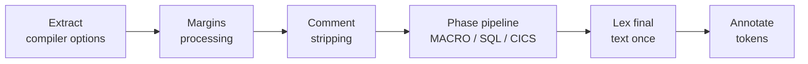

# Preprocessor

The preprocessor is the first stage of the PL/I document [lifecycle](./ARCHITECTURE.md#lifecycle): it turns raw source text into the token stream that the parser consumes.
It covers three preprocessor languages: the PL/I **macro** language (`%`-prefixed statements, `%IF`/`%SELECT`/`%DO`, `%INCLUDE`, preprocessor `PROCEDURE`s, and an extensive builtin library), and the external **SQL** (DB2) and **CICS** preprocessors that translate `EXEC SQL`/`EXEC CICS` statements.
This document describes how that subsystem is wired together, living under [`packages/language/src/preprocessor/`](../packages/language/src/preprocessor/), with the SQL/CICS engines in the separate [`preprocessor-db2`](../packages/preprocessor-db2/), [`preprocessor-cics`](../packages/preprocessor-cics/), and [`preprocessor-api`](../packages/preprocessor-api/) packages.

Architecturally, the preprocessor is a pipeline of **text-to-text phases**: every phase consumes a string and produces a new string plus a [source map](#source-maps) describing how the output relates to its input.
The maps of all phases compose into a single map from the original document to the final preprocessed text, that text is lexed **exactly once**, and an annotation pass maps every resulting token back to its original source position.
This is what lets the external SQL/CICS preprocessors see full statement text (as the real precompilers do), lets macro-generated code contain `EXEC` statements for a later phase to translate, and keeps every LSP position anchored in the original files.

Two cross-cutting concerns are worth flagging up front.
First, the preprocessor records which `%IF`/`%SELECT` branches were actually taken; this data backs the `pli/skippedCode` language-server feature (see [LANGUAGE-SERVER.md](./LANGUAGE-SERVER.md)) which greys out untaken branches in the editor.
Second, the entire chain `%INCLUDE` -> sub-file -> nested `%INCLUDE` is what makes one `CompilationUnit` span several files, as described in [ARCHITECTURE.md](./ARCHITECTURE.md).

## Position in the lifecycle

The lifecycle ([lifecycle.ts](../packages/language/src/workspace/lifecycle.ts)) runs *tokenize -> parse -> symbol table -> link -> validate*.
The preprocessor *is* the tokenize step.
It is orchestrated by [`PliLexer.tokenize`](../packages/language/src/preprocessor/pli-lexer.ts):

1. **Extract compiler options** (`*PROCESS`/`%PROCESS` directives) via [`CompilerOptionsProcessor`](../packages/language/src/preprocessor/compiler-options-processor.ts). The resulting options are stored on the `CompilationUnit` and pushed into the PL/I tokenizer.
2. **Margins processing** ([`MarginsProcessor`](../packages/language/src/preprocessor/pli-margins-processor.ts)) blanks out the source margins so only program text remains.
3. **Comment stripping** ([`stripComments`](../packages/language/src/preprocessor/comment-stripper.ts)) blanks every comment to whitespace, again preserving offsets. Steps 2-3 produce the text that seeds the phase pipeline; they are memoized per file text in the `TokenizationCache`.
4. **The phase pipeline** ([`runPipeline`](../packages/language/src/preprocessor/pp-pipeline.ts)) runs the phases configured by the `PP(...)` compiler option in order - each a `{text, sourceMap} -> {text, sourceMap}` transform - and composes their source maps into one.
5. **Lex once**: the pipeline's final text is tokenized in a single pass.
6. **Annotate** ([`annotateTokens`](../packages/language/src/preprocessor/token-annotator.ts)): every token's offsets and URI are rewritten back to the original source through the composed map, and cross-reference metadata recorded by the phases is re-attached.

The result carries the annotated tokens (fed to the parser), the final `preprocessedText` (stored on the `CompilationUnit`, see [below](#the-preprocessed-text-view)), the collected preprocessor `statements`, the `evaluationResults` (branch executions), and synthetic token references.

## Margins processing

PL/I source is column-oriented.
By default only columns `2`–`72` are program text (`MARGINS(2,72)`); everything outside the margins is sequence numbers or carriage-control characters.
`MarginsProcessor.processMargins` reads the effective `MARGINS(m,n)` from the compiler options (falling back to `2`/`72`) and rewrites each line so that the `m-1` prefix columns and any text past column `n` are replaced with spaces, preserving the original line length and EOL so that all downstream token offsets still line up with the source document.

Margin *checking* is optional and gated on the process group's `check-margins` LSP option (see [PLUGIN-CONFIG.md](./PLUGIN-CONFIG.md)).
When enabled, the scanner reports left-margin and right-margin violations (`IBM1084I` for the right margin), with two deliberate exemptions: lines that begin with `%PROCESS`/`*PROCESS` are not flagged on the left, and the prefix area is allowed to contain only the characters matched by `PREFIX_PATTERN` (`[0-9+\- \r\t]`), since real-world code puts digits, `+`, and `-` in column 1.
The right margin is also tolerant of a trailing sequence field.

## Comment stripping

External SQL/CICS preprocessors scan the *full text* of an `EXEC` statement rather than tokens, so they must never see PL/I comment characters embedded in `EXEC` code - a comment could contain unbalanced quotes, a stray `;`, or an `EXEC SQL`-looking substring.
[`stripComments`](../packages/language/src/preprocessor/comment-stripper.ts) therefore runs once, on the margin-stripped original text, before any phase: it blanks every `/* ... */` block comment and `//...` line comment to whitespace, preserving every other character's offset (mirroring the margins processor's length-preserving blanking).
String literals are skipped whole - reusing the real tokenizer's own string pattern - so a comment-looking sequence inside a string is never mistaken for a comment.
The stripped comment ranges are converted into comment tokens for LSP services (semantic highlighting, hover), sourced from the *pre-strip* text.

## Compiler options

`*PROCESS`/`%PROCESS` directives (and the equivalent options from the plugin `pgm_conf.json` configuration) are parsed and translated before anything else, because options such as `MARGINS`, `OR`, `NOT`, `CASE`, and `GRAPHIC` change how the rest of the file must be tokenized.

### Extraction and parsing

[`CompilerOptionsProcessor.getCompilerOptionsRange`](../packages/language/src/preprocessor/compiler-options-processor.ts) hand-scans the text for `PROCESS` directives at column 0, correctly skipping comments and strings, and supporting multi-line directives terminated by `;` (text after the first `;` on a directive is ignored).
It replaces each directive span with equal-length whitespace so positions are preserved, then hands the option text to [`parseAbstractCompilerOptions`](../packages/language/src/preprocessor/compiler-options/parser.ts) - a small Chevrotain-based parser producing an `AbstractCompilerOptions` AST (`name(value, value, ...)` options, possibly nested).

### Translation and dialects

The abstract options are turned into a typed [`CompilerOptions`](../packages/language/src/preprocessor/compiler-options/options.ts) object by the translator in [translate.ts](../packages/language/src/preprocessor/compiler-options/translate.ts).
There are four dialects, each with its own option shape, defaults, and rule table:

- **PLI** ([options-pli.ts](../packages/language/src/preprocessor/compiler-options/options-pli.ts), [translator-pli.ts](../packages/language/src/preprocessor/compiler-options/translator-pli.ts)) - the main option set: `MARGINS`, `MARGINI`, `INCAFTER`, the `PP(...)` preprocessor list and its `PPINCLUDE` value, `SYSPARM`, `SYSTEM`, `CMPAT`, `LP`, etc.
- **MACRO** ([options-macro.ts](../packages/language/src/preprocessor/compiler-options/options-macro.ts), [translator-macro.ts](../packages/language/src/preprocessor/compiler-options/translator-macro.ts)) - macro-preprocessor tuning: `CASE`, `RESCAN`, `FIXED`, `DBCS`, `NAMEPREFIX`, `DEPRECATE`. `RESCAN(ASIS)`, for example, controls whether re-scanned macro output is upper-cased.
- **SQL** ([options-sql.ts](../packages/language/src/preprocessor/compiler-options/options-sql.ts), [translator-sql.ts](../packages/language/src/preprocessor/compiler-options/translator-sql.ts)) - DB2/SQL preprocessor options (`CCSID0`, `CODEPAGE`, `HOSTCOPY`, `LINE`, ...).
- **CICS** ([options-cics.ts](../packages/language/src/preprocessor/compiler-options/options-cics.ts), [translator-cics.ts](../packages/language/src/preprocessor/compiler-options/translator-cics.ts)) - CICS preprocessor options (`DEBUG`, `DLI`, `EDF`, `FLAG`, `GRAPHIC`, ...).

The nested `PP(MACRO ...)` / `PP(SQL ...)` / `PP(CICS ...)` option strings are re-parsed and routed to their sub-translators.
Plugin-config options are translated *first* so that duplicate / mutually-exclusive options in the source file can be detected against them.

The [`Translator`](../packages/language/src/preprocessor/compiler-options/translator.ts) base class records each applied rule and reports **duplicate** and **mutually-exclusive** usages, plus **unknown option** (`IBM1159I`, promoted to error).
Validation helpers (`ensureArguments`, `ensureType`, `ensureEnum`, ...) throw structured diagnostics drawn from the large per-option [codes.ts](../packages/language/src/preprocessor/compiler-options/codes.ts) table.

### Recompile fingerprint

Some option rules carry a `recompile: true` flag, marking them as reaching the lexer/parser (e.g. `MARGINS`, `OR`, `NOT`, `CASE`).
A stable fingerprint is built from those applied rules and their concrete argument values.
`PliLexer` feeds this into the `InstructionCache` and `TokenizationCache`: when the fingerprint changes, both caches are cleared so files are re-tokenized under the new option semantics.

## The phase pipeline

[`buildPhases`](../packages/language/src/preprocessor/pli-lexer.ts) maps the `PP(...)` option to an ordered phase list: each `MACRO` item is its own [`MacroPreprocessorPhase`](../packages/language/src/preprocessor/macro-phase.ts) pass (so `PP(MACRO MACRO)` runs the macro preprocessor twice, allowing the second pass to expand macro code the first generated), `INCLUDE` reuses the macro phase, and `SQL`/`CICS` become [`ExecSqlPreprocessorPhase`/`ExecCicsPreprocessorPhase`](../packages/language/src/preprocessor/exec-phase.ts).
When nothing is configured at all, the default compiler options apply - `PP(MACRO SQL CICS)` - so all three preprocessors run; only when the configured options end up without any `PP` items does the pipeline fall back to just the macro phase.
An [`UnresolvedExecPhase`](../packages/language/src/preprocessor/exec-phase.ts) always runs last: any `EXEC CICS`/`EXEC SQL` statement still present at that point means the corresponding preprocessor was not configured, so it reports a compiler-options diagnostic on the statement and substitutes `DO; END;` to keep the final parse quiet.

Every phase implements [`PreprocessorPhase`](../packages/language/src/preprocessor/pp-phase.ts).
[`runPipeline`](../packages/language/src/preprocessor/pp-pipeline.ts) threads the text through the phases, composes each phase's map into the running one, remaps each phase's diagnostics from its own input space back to original-source positions, and accumulates statements and directive tokens.

Two performance properties are important here (the pipeline must handle multiple 100k-line files; see the benchmarks under [`test/benchmarks/`](../packages/language/test/benchmarks/)):

- Every phase starts with a **cheap pre-scan** (e.g. `mayContainMacroStatements`, the exec phases' trigger patterns): when the input text cannot contain the phase's constructs, the phase returns [`passthroughPhaseResult`](../packages/language/src/preprocessor/pp-phase.ts) - text untouched under an identity map - skipping its full tokenize/parse pass, which otherwise dominates pipeline time on files that don't use the preprocessor.
- Source-map lookups are binary searches and `compose` is a linear merge, so mapping work is proportional to the number of *edits*, never the number of tokens.

### Directive tokens

Tokens consumed by a directive (`%IF`/`%DCL` keywords, `EXEC` statement bodies, ...) never reach a phase's output text, so they would be invisible to `unit.services.files.getTokens(uri)` - which only sees the pipeline's final, post-substitution tokens.
Each phase therefore reports them separately as `directiveTokens`, already remapped to original-source positions.
LSP features that inspect a directive itself rather than its expansion (`pli/skippedCode`, hovering a `%DCL`'d variable, semantic highlighting of macro variable references and `EXEC` bodies) rely on these.

## Source maps

[`SourceMap`](../packages/language/src/preprocessor/source-map.ts) is a bidirectional, offset-based map between a phase's input and output text, stored as a sorted list of non-overlapping segments covering the whole output:

- **Verbatim** segments are a straight offset-for-offset copy of the input - unchanged code needs no per-token bookkeeping.
- **Non-verbatim** segments come from a `replace`/`insert` edit: the whole generated span maps back to the original edit's range as one block, and may carry `MappedToken` metadata describing sub-spans of interest (cross-reference targets, exact-casing images, the real source token a span was serialized from).
- **Foreign** segments carry real offsets into a *different file* (an `%INCLUDE`d file's content, or a nested `EXEC SQL INCLUDE` splice) - composition passes them through without re-anchoring.

`SourceMap.compose(first, second)` produces the map from `first`'s input to `second`'s output; the pipeline folds all phase maps into one this way, so any offset in the final text resolves to a `{uri, offset}` in an original file.

[`PreprocessorContext`](../packages/language/src/preprocessor/preprocessor-context.ts) is the mutable text-builder the SQL/CICS phases (and the `UnresolvedExecPhase`) edit against: `replace(range, text, tokens)` and `insert(offset, text)` accumulate non-overlapping edits, `resolveInclude(name)` resolves an `EXEC SQL INCLUDE` (with a `prepareText` hook applying margins and comment stripping to the included file, and an include-chain cycle guard), `insertContext` splices a nested context's built result in as foreign segments, and `build()` stitches the untouched gaps and the edits into output text plus a source map.

## The macro language

The macro phase tokenizes its own input text, parses the `%` statements, lowers them into instructions, interprets them, and serializes the resulting token stream back into `{text, sourceMap}` - the interpreter's internals deliberately stay token-based; only the phase boundary is text.

### Instruction generation

After the file is parsed into preprocessor `Statement`s, [`generateInstructions`](../packages/language/src/preprocessor/instruction-generator.ts) lowers them into a graph of `InstructionNode`s (each `{ labels, instruction, next? }`) defined in [instructions.ts](../packages/language/src/preprocessor/instructions.ts).
This is essentially a compile step from AST to a tiny bytecode-like IR with explicit control flow:

- Sequential statements form a linked list ending in a synthetic `Halt`.
- `%IF` is lowered to a `Select` instruction with a true-branch case (condition = the `%IF` expression) and an optional empty-condition false-branch case; `%SELECT`/`%WHEN`/`%OTHERWISE` lowers to the same `Select` shape.
- `%DO` becomes a `Do` instruction; iterating/leaving (`%ITERATE`/`%LEAVE`) and `%GOTO` become `Goto` instructions whose target node is patched up once all nodes exist.
- `DECLARE`/`%REPLACE` become `Declare` instructions; assignments, `%ACTIVATE`/`%DEACTIVATE`, `%INCLUDE`/`INSCAN`, `%NOTE`, `ANSWER`, and `CALL` each get their own instruction kind.
- Preprocessor `PROCEDURE`s are collected separately into a procedure container map (keyed by every label name), not inlined into the main list.
- Everything that is *not* a `%` statement - including whole `EXEC SQL`/`EXEC CICS` statements, which the tokenizer folds into a single `ExecFragment` token - passes through as a plain `Tokens` instruction; `EXEC` translation is entirely the later phases' job.

Because branch and loop targets reference nodes that may not be generated yet, the generator defers `next`-pointer wiring into callbacks executed in reverse at the end.

### Interpretation

[`runInstructions`](../packages/language/src/preprocessor/instruction-interpreter.ts) walks the instruction graph from the entry node, maintaining a context with a scoped symbol table (global variables plus per-procedure local scopes), the active procedure set, the accumulating output `tokens`, diagnostics, and the cross-file include bookkeeping.

Key behaviors:

- **Values** are scalars (string/`FIXED`, stored as strings) or n-dimensional arrays. Operators, `%DO` ranges, and conditions are evaluated over these values; non-scalar operands in conditions cause the branch to be treated as un-evaluable.
- **Token replacement / rescanning**: `Tokens` instructions copy source tokens to the output, but each identifier is checked against active global variables and active procedures. A match substitutes the variable's value (re-lexed and recursively re-scanned) or invokes the procedure inline (parsing its `( ... )` arguments straight from the token stream). An `immediateFollow` flag is tracked so adjacent tokens merge correctly (macro output concatenated with following text). The matched reference token receives a pre-resolved synthetic reference to the variable's declaration, which is what backs go-to-definition on macro variable usages.
- **`EXEC` fragments**: active macro variables are expanded *inside* an `ExecFragment` token's image too - the mainframe macro preprocessor scans `EXEC` text like any other source. The fragment is split at each replaced occurrence, so untouched slices keep exact verbatim positions in the source map, and each occurrence yields a reference token linking back to the variable's declaration. This is how a macro variable can hold (part of) an `EXEC SQL` statement for the SQL phase to translate afterwards.
- **Procedures** run synchronously in a fresh local scope; `RETURN` sets the context return value. Function-like and `STATEMENT`-style procedures are invoked differently.
- **Builtins**: a large `builtinImplementations` map provides `SUBSTR`, `INDEX`, `LENGTH`, `TRIM`, `TRANSLATE`, `VERIFY`, `COPY`/`REPEAT`, `MIN`/`MAX`, `COUNTER`, `COLLATE`, `QUOTE`, the `SYS*` informational builtins (`SYSPARM`, `SYSTEM`, `SYSVERSION`, ...), `MACLMAR`/`MACRMAR` (driven by the `MARGINS` option), array-bound builtins (`HBOUND`/`LBOUND`/`DIMENSION`), and others. Several carry `TODO`s noting incomplete fidelity (e.g. `MACCOL` returns 0; `COMPILEDDATE`/`COMPILETIME` return fixed epoch values).

### Serialization

The interpreter's output tokens are turned back into `{text, sourceMap}` by [`serializeTokens`](../packages/language/src/preprocessor/token-serializer.ts).
Runs of same-file tokens are sliced directly out of the phase text as verbatim segments; tokens from an `%INCLUDE`d file become *foreign* verbatim segments reconstructed from their images (each remembering its original token object, see [below](#the-final-lex-and-token-annotation)); generated tokens (macro-substituted values) become non-verbatim segments anchored at the nearest preceding source position.
Separator spaces are inserted at run boundaries unless `immediateFollow` says the source truly had no gap - which is exactly what lets a macro emission merge with the following source text (`PUT (A` + `);`) while two separate emissions never accidentally fuse into one token.
Because the *final* text is lexed once, a construct opened in one macro emission and closed in another lexes correctly by construction.

### Branch executions and `pli/skippedCode`

The select interpreter records, per `%IF`/`%SELECT` syntax node, a `Map<caseIndex, true | undefined>` into the context's `branchExecutions`.
A `true` entry means that case was taken; `undefined` means the condition could not be evaluated; a missing entry means the case was definitively *not* taken.
[`skipped-code.ts`](../packages/language/src/language-server/skipped-code.ts) reads this map: for each `%IF`/`%SELECT` token it emits ranges for branches that were *not* executed (and also handles `%DO SKIP; ... %END;`), and pushes them to the client via the `pli/skippedCode` notification so the editor can grey out dead code.

### Safeguards

The interpreter is a Turing-complete macro language, so it is bounded against runaway loops and recursion.
`runInstructions` computes an instruction-counter limit from the process group's `instruction-counter-limit` LSP option, clamped between `1` and `MAX_INSTRUCTION_LIMIT` (`50000`) and defaulting to `DEFAULT_INSTRUCTION_LIMIT` (`5000`).
The runner counts visits per node and aborts once a node exceeds the limit.
Additional guards: circular `next`-chain detection, a `MAX_ARRAY_COUNT` (100 000) cap on array sizes and `COPY`/`REPEAT` output, the `COUNTER` builtin wrapping at 99999, and a workaround for V8's spread-argument limit when emitting very large token arrays.

## The SQL and CICS phases

The `EXEC` phases mirror how the real precompilers work: the engine receives the phase's **full text** and finds its own `EXEC SQL ...;`/`EXEC CICS ...;` statements, rather than being handed pre-cut fragments.

- **Scanning**: [`scanExecFragments`](../packages/preprocessor-api/src/context-utils.ts) performs one linear walk that skips the host language's quoted strings and comments (per-engine [`Delimiters`](../packages/preprocessor-api/src/context-utils.ts)), so neither the `EXEC <prefix>` anchor nor the terminating `;` can be matched inside them. A statement that never closes is emitted as an unterminated fragment so it still gets parsed and diagnosed.
- **Engines**: [`Db2SqlPreprocessor`](../packages/preprocessor-db2/src/engine/preprocessor.ts) and [`CICSPreprocessor`](../packages/preprocessor-cics/src/engine/preprocessor.ts) parse each fragment body with their ANTLR grammars, classify every body token (keyword/identifier/string/number/comment), report diagnostics (rebased into host coordinates), and record one edit per statement against the shared [`PreprocessorContext`](../packages/language/src/preprocessor/preprocessor-context.ts). The [`preprocessor-api`](../packages/preprocessor-api/src/types.ts) package defines the engine-facing contract; `RecordingPreprocessorContext` is its conformance harness.
- **Replacement**: an ordinary statement is replaced with `DO; PUT(id); ... END;` - one `PUT` per identifier used in the statement (host variables, and each name part of a qualified `:A.B` separately) - so the real parser sees valid PL/I *and* creates ordinary, linkable references for every host variable. `EXEC SQL INCLUDE member` instead resolves the member (via `resolveInclude`, taking the same lib-resolution path as `%INCLUDE`) and splices the included file's own recursively-processed content in as foreign segments; the statement becomes a regular `IncludeDirective` in the preprocessor AST, riding the same hover/definition/validation paths as `%INCLUDE`.
- **Metadata**: `collectExecMetadata` in [exec-phase.ts](../packages/language/src/preprocessor/exec-phase.ts) turns the recorded edits into the statement's LSP-facing artifacts - per-body-token semantic-highlighting tokens in host coordinates (registered via `directiveTokens`), and the link between each re-embedded identifier and its real source position (see the annotation pass below). Tokens whose text was itself macro-generated have no host position and are deliberately left unregistered.
- **Native handlers**: two constructs are recognized PL/I-side because they can appear *outside* `EXEC` statements: `SQL TYPE IS ...` attribute declarations (replaced with their PL/I equivalent types, inserting the `SQL_LOB*` declaration blocks once per procedure when needed) and `DFHRESP(...)` (replaced with the numeric CICS response code). Every procedure containing an `EXEC CICS` statement additionally gets the `DFH*` runtime declarations (`DFHEIBLK` with `EIBRESP` etc.) inserted once, right after the procedure's `;`.

## The final lex and token annotation

After the last phase, the composed text is lexed once and [`annotateTokens`](../packages/language/src/preprocessor/token-annotator.ts) walks the result:

- Every token's `startOffset`/`endOffset`/`uri` are rewritten to the original source through the composed map (tokens carry **offsets only** - line/column is computed on demand at the LSP boundary via `offsetToPosition`).
- Where a non-verbatim segment recorded a `MappedToken` whose span exactly matches the re-lexed token, the annotator emits the **original token object** instead (`MappedToken.sourceToken`): the included file's own token for `%INCLUDE`d content, or the exec phase's real-positioned identifier token for a re-embedded host variable. The real parser then attaches its `.kind`/`.element` CST data to the very object that position-based LSP lookups will find - this identity sharing is what makes go-to-definition, find-references, and semantic tokens work across includes and inside `EXEC` bodies.
- Tokens lexed from generated text that has no source position of its own are marked `synthetic`; their offsets collapse to the generating edit's anchor.

`registerFileTokens` then registers each file's tokens with the file store for position-based LSP lookups: the entry file gets its own annotated tokens plus its directive tokens; annotated tokens and directive tokens attributed to a *foreign* file (includes) are merged into that file's registration; `synthetic` tokens are excluded everywhere.

### Generated code and the LSP

Generated tokens exist in no source file, so surfacing their (collapsed) positions would point at whitespace.
The language server therefore treats them specially:

- Find references, document highlight, and go-to-definition **suppress** locations whose token is `synthetic` ([resolver.ts](../packages/language/src/linking/resolver.ts), [definition-request.ts](../packages/language/src/language-server/definition-request.ts)). For example, go-to-definition on `EIBRESP` (declared only in the generated `DFH*` block) reports no definition rather than a whitespace jump.
- **Rename** refuses outright - with an error surfaced in the client's rename UI - when the symbol's declaration is generated, or when it is a builtin (`pli-builtin:` scheme); for renameable symbols, generated usages are excluded from the edit set ([rename-request.ts](../packages/language/src/language-server/rename-request.ts)).

### The preprocessed text view

The pipeline's final text is stored as `CompilationUnit.preprocessedText` and served over the `pli/getPreprocessedText` request (with a `pli/preprocessedTextChanged` notification on change).
The VS Code extension exposes it through the `pli.showPreprocessedText` command as a read-only virtual document (`pli-preprocessed:` scheme), letting users inspect exactly what the parser saw - including macro expansions, `EXEC` replacements, and the generated declaration blocks.

## %INCLUDE resolution

`%INCLUDE`, the `INCLUDE_ALT` form, and `INSCAN` (which computes the file name from a macro variable) are the only macro instructions that touch the filesystem, so they run asynchronously ([include-resolver.ts](../packages/language/src/preprocessor/include-resolver.ts)).
They are what stitch multiple files into one `CompilationUnit`.
`EXEC SQL INCLUDE` resolves through the same machinery via `PreprocessorContext.resolveInclude`.

Resolution handles two on-disk shapes:

- **File includes** (`%INCLUDE "name";`) - look `name` up (with the process group's configured extensions) in each lib's pre-built file index, falling back to a live existence check for files added after lib expansion.
- **Member includes** (`%INCLUDE LIBNAME(member);` or `%INCLUDE member;`) - look the member up in a directory lib's member map or a DDName lib's member map. Mainframe data-set members surface as sibling files named `LIBNAME(member)`. Dataset members win over plain files when both match.

When `member-name-validation` is enabled on the process group, member names are checked against the mainframe rules (≤ 8 chars).
SQL builtins `SQLCA`/`SQLDA` resolve to virtual builtin URIs rather than disk files.

In the interpreter, include handling resolves the URI then guards against re-inclusion: idempotent includes that were already pulled in are skipped, and cyclic includes (URI already on the active stack) are rejected with a diagnostic - the same cycle guard protects `EXEC SQL INCLUDE` chains.
On success it loads the document, runs the *same* margin -> tokenize -> preprocessor-parse -> generate-instructions pipeline (through the shared `InstructionCache`), merges the sub-file's procedures into the current context, registers the sub-file's tokens with the file service, and recursively interprets the included instructions in a child context.
Unresolved includes produce either a "missing configuration" diagnostic (when no process group/program config exists) or `IBM1848I`, tagged with `unresolvedFile`/`entryUri` data so the client can offer a quick fix (see [PLUGIN-CONFIG.md](./PLUGIN-CONFIG.md#relationship-to-quick-fixes)).

The `INCAFTER(PROCESS(name))` option is handled specially: it synthesizes a single `%INCLUDE` instruction prepended as the very first instruction in the stream (and a synthetic `IncludeItemFile` AST node so LSP "go to definition" works), allowing exactly one file to be included before normal preprocessing begins.

## Caching

Two per-unit caches memoize the file-local parts of preprocessing, both invalidated wholesale when the compiler-options recompile fingerprint changes (such options alter tokenization itself):

- The [`TokenizationCache`](../packages/language/src/preprocessor/instruction-cache.ts) memoizes the prepared source (margins + comment stripping + comment tokens) for the entry file, keyed by its text.
- The [`InstructionCache`](../packages/language/src/preprocessor/instruction-cache.ts) memoizes the macro phase's file-local work (tokenize, preprocessor-parse, instruction generation) per URI, validated against the file text, shared across the entry file and all included files.

The cross-file interpretation step and the phase pipeline itself are never cached, since they depend on the include graph and macro state assembled at run time.
Wall-time budgets for the whole pipeline are pinned by the benchmarks under [`test/benchmarks/`](../packages/language/test/benchmarks/).
