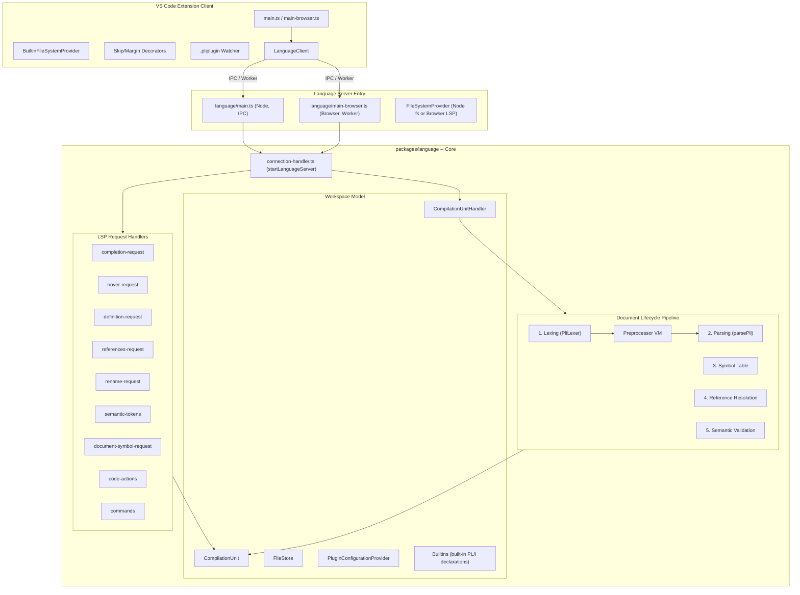
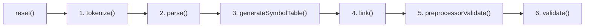
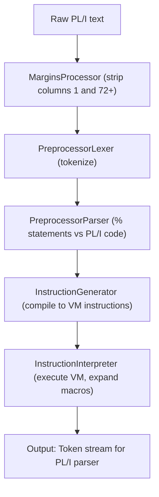
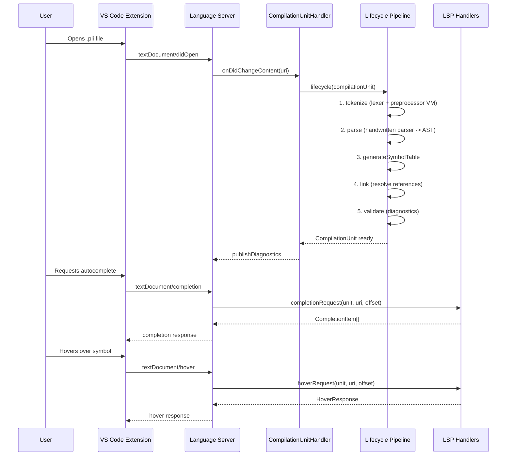

# PL/I Language Support — Architecture Overview

This document provides a structured architecture overview of the Broadcom PL/I Language Support VS Code extension for engineers onboarding to the repository.

> **Prerequisite knowledge:** This document assumes you know what VS Code extensions are, what the Language Server Protocol (LSP) is, and have a basic understanding of compilers (lexing, parsing, ASTs). If you are unfamiliar with PL/I, see the [Glossary](glossary.md) for key terms.

## 1. High-Level Purpose

This project is a **PL/I language server and VS Code extension** that provides IDE features (diagnostics, autocompletion, hover, go-to-definition, references, rename, semantic highlighting, code actions) for the PL/I programming language used on IBM mainframes. It runs both as a **Node.js VS Code extension** and as a **browser-based Monaco playground**.

---

## 2. Monorepo Structure

A **pnpm workspace** with three packages:

```
broadcom-pli-ai-support/
  packages/
    language/          -- Core language server logic (parser, linker, typesystem, LSP handlers)
    vscode-extension/  -- VS Code extension client + server entry points
    playground/        -- Monaco Editor web playground (Vite + monaco-languageclient)
```

- **Build:** `tsc -b` with project references, then `esbuild` for bundling
- **Tests:** Vitest, with a large "fourslash" test harness for integration testing
- **Grammar:** A Langium config exists (`pli.langium`) for grammar specification, but the actual parser is **handwritten** using Chevrotain-style token definitions. The tokenizer uses Chevrotain's `createToken` and token category system for defining PL/I tokens and keywords.

---

## 3. Key Directories and Why They Exist

| Directory | Purpose |
|-----------|---------|
| `packages/language/src/parser/` | Handwritten PL/I parser (Chevrotain-based), tokenizer, token types |
| `packages/language/src/preprocessor/` | PL/I macro preprocessor — a full **stack-based virtual machine** |
| `packages/language/src/linking/` | Symbol table construction, scope management, reference resolution |
| `packages/language/src/typesystem/` | Type inference, assignability checking, type descriptions |
| `packages/language/src/validation/` | Diagnostic rules: IBM compiler codes, LSP codes, macro validations |
| `packages/language/src/syntax-tree/` | AST and CST node definitions and utilities |
| `packages/language/src/language-server/` | LSP request handlers (completion, hover, definition, references, etc.) |
| `packages/language/src/workspace/` | CompilationUnit model, FileStore, lifecycle, plugin configuration |
| `packages/language/src/utils/` | Shared utilities (caching, collections, config, URI handling) |
| `packages/language/test/` | Unit tests, fourslash integration tests, parser tests |
| `packages/vscode-extension/src/extension/` | Extension activation (Node + Browser) |
| `packages/vscode-extension/src/language/` | Language server entry points (Node + Browser) |
| `packages/vscode-extension/src/common/` | Shared extension logic (config handler, messages) |
| `packages/vscode-extension/schemas/` | JSON schemas for `.pliplugin/pgm_conf.json` and `proc_grps.json` |
| `packages/playground/` | Browser-based Monaco playground for trying PL/I |
| `docs/` | Architecture documentation |
| `scripts/` | License header checks, TextMate grammar generation |

---

## 4. Main Architectural Components



---

## 5. The Runtime Flow: From Opening a PL/I File to Diagnostics/Autocomplete

For a step-by-step trace with file names and line references, see [Execution Flow](execution-flow.md).

### 5a. Extension Activation

1. **VS Code loads the extension** (`packages/vscode-extension/src/extension/main.ts`)
2. `activate()` registers a `BuiltinFileSystemProvider` (serves built-in PL/I declarations via a `pli-builtin://` URI scheme)
3. Creates a `LanguageClient` that spawns the language server process via **IPC** (Node) or **Web Worker** (Browser), pointing to `packages/vscode-extension/src/language/main.ts`
4. Registers decorators for skipped code and margin indicators
5. Watches `.pliplugin/*.json` files and forwards changes to the server

### 5b. Language Server Start

1. `packages/vscode-extension/src/language/main.ts` creates a `NodeFileSystemProvider` and calls `setFileSystemProvider()`, then calls `startLanguageServer(connection)` from the core library
2. `packages/language/src/language-server/connection-handler.ts` creates a `CompilationUnitHandler`, registers all LSP request handlers, and calls `connection.listen()`
3. On `onInitialize`: returns server capabilities (completion, hover, definition, references, rename, code actions, semantic tokens, document symbols, workspace symbols)
4. On `onInitialized`: loads `.pliplugin` configuration per workspace folder via `PluginConfigurationProvider`, then marks the server as ready

### 5c. Document Lifecycle (per file change)

When a PL/I file is opened or edited, the `CompilationUnitHandler` triggers the lifecycle pipeline defined in `packages/language/src/workspace/lifecycle.ts`. The pipeline runs **six steps** in fixed order:



Between each step, `interruptAndCheck(cancellation)` is called so the server can cancel outdated work if the user keeps typing.

**Step 1 — Lexing/Tokenization** (the most complex step):

The `PliLexer` orchestrates a multi-stage pipeline:



The preprocessor is a **stack-based virtual machine** with instructions like PUSH, POP, SCAN, PRINT, SET, GET, ACTIVATE, DEACTIVATE, BRANCHIFNEQ, GOTO, COMPUTE, HALT. It handles `%DECLARE`, `%IF/%THEN/%ELSE`, `%DO`, `%INCLUDE`, `%INSCAN`, macro procedures, and variable substitution.

**Step 2 — Parsing:** The handwritten recursive-descent parser (`packages/language/src/parser/parser.ts`) consumes the token stream and produces an AST (`ast.Program`) plus parser diagnostics. As a side effect, the parser annotates each token with the `SyntaxNode` it belongs to and its role (e.g. is this identifier a name being declared, or a reference to something declared elsewhere?). This annotation is what makes LSP features like hover and go-to-definition efficient: they can look up a token at an offset and immediately know its semantic role.

**Step 3 — Symbol Table:** `packages/language/src/linking/symbol-table.ts` traverses the AST and:

- Sets `container` pointers on every AST node, enabling upward tree traversal (parent access). This is important: the parser creates the tree structure, but only this step makes it navigable in both directions.
- Adds named elements (declarations, labels, procedures) to the `SymbolTable` — a `MultiMap<string, QualifiedSyntaxNode>` keyed by name, scoped by the containing procedure or block.
- Collects `Reference` objects (identifiers that refer to other declarations) into the `ReferencesCache` for resolution in the next step.
- Handles PL/I-specific complexity: structured declarations with levels (e.g. `1 A, 2 B, 3 C`), factorized declarations, wildcard qualifications, LIKE attribute, TYPE definitions (ALIAS, ORDINAL, STRUCTURE).

**Step 4 — Reference Resolution:** `packages/language/src/linking/resolver.ts` iterates the `ReferencesCache` and resolves each reference by walking up the scope chain. Explicit declarations take priority; implicit declarations trigger warnings. Supports partial and full qualification (`A.B.C`).

**Step 5 — Validation:** Two phases:

- **Preprocessor validation** (`packages/language/src/validation/pp-validator.ts`): checks on preprocessor AST
- **PL/I validation** (`packages/language/src/validation/pli-validator.ts`): checks on main AST, including IBM compiler diagnostic codes (IBM1059I, IBM1219I, IBM2412I, etc.), type checking, and deprecation warnings

### 5d. LSP Requests

After the lifecycle completes, the `CompilationUnit` holds all computed data. LSP request handlers query it:

- **Completion** (`packages/language/src/language-server/completion/completion-request.ts`): Uses token context + follow elements from grammar to suggest keywords, variables, and type references. Supports fuzzy matching.
- **Hover** (`packages/language/src/language-server/hover-request.ts`): Shows type info, procedure signatures, include paths. Uses multiple "markup generators" that attempt to produce hover content.
- **Go-to Definition** (`packages/language/src/language-server/definition-request.ts`): For references, resolves to declaration location. For includes, navigates to the included file.
- **Find References** (`packages/language/src/language-server/references-request.ts`): Uses the `ReferencesCache` reverse map.
- **Semantic Tokens** (`packages/language/src/language-server/semantic-tokens.ts`): Iterates tokens and assigns semantic types (variable, keyword, function, enum, type, etc.).
- **Code Actions** (`apply-quick-fixes.ts`, `apply-source-actions.ts`): Quick fixes for ambiguous references and source-level actions.
- **Commands** (`packages/language/src/language-server/commands.ts`): `resolveInclude` (creates files) and `createConfig` (creates `.pliplugin` config).

---

## 6. The CompilationUnit Model

The `CompilationUnit` (`packages/language/src/workspace/compilation-unit.ts`) is the central data structure. It represents not a single file but a **graph of files connected via `%INCLUDE` macros**. Key fields:

- `uri` — entry-point file URI (the main `.pli` file, not included copybooks)
- `tokens` — flat array of all tokens after preprocessing (the final stream fed to the parser)
- `ast` — parsed PL/I AST (`Program` node), the main tree used by all subsequent steps
- `preprocessorAst` — preprocessor AST (the tree of `%IF`, `%DECLARE`, etc. statements)
- `preprocessorEvaluationResults` — macro expansion branch execution results (which `%IF` branches were taken)
- `referencesCache` — all reference-to-declaration mappings (powers go-to-definition and find-references)
- `statementOrderCache` — tracks statement ordering for "use before declare" warnings
- `scopeCaches` — scope trees per AST block (procedure, package, begin), used during linking
- `rootScope` / `rootPreprocessorScope` — top-level scope trees, pre-populated with built-in PL/I declarations
- `diagnostics` — `DiagnosticsStore` accumulating errors/warnings from all phases (categories: CompilerOptions, Lexer, Parser, SymbolTable, Linking, TypeSystem, Validation)
- `compilerOptions` — parsed compiler options (margins, macro settings, etc.)
- `programConfig` / `processGroup` — lazily cached lookups from `.pliplugin` configuration
- `services.files` (`FileStore`) — per-file data for all files in the unit (entry file + all included files), including each file's `TextDocument` and tokens
- `services.typeCache` — caches resolved types to avoid recomputation
- `services.includeCache` — LRU cache of recently included file contents
- `services.inferer` — type inference engine

The `CompilationUnitHandler` manages the collection of active compilation units and listens to `EditorDocuments` for changes. It maintains a `Map<string, CompilationUnit>` where keys are file URI strings. Importantly, multiple URIs can map to the same `CompilationUnit` — if `A.pli` includes `B.pli`, both URIs point to the same unit. This means an LSP request for `B.pli` is served by the compilation unit owned by `A.pli`.

---

## 7. Configuration System (Summary)

The extension uses a `.pliplugin/` directory in the workspace root with two JSON files:

- **pgm_conf.json:** Maps PL/I program files to process groups (and optionally compiler options)
- **proc_grps.json:** Defines process groups with library paths, compiler options, include extensions, and LSP options

The `PluginConfigurationProvider` (`packages/language/src/workspace/plugin-configuration-provider.ts`) loads, caches, and provides this configuration. For full details, see [Configuration System](configuration-system.md).

---

## 8. External Dependencies and Frameworks

| Dependency | Role |
|------------|------|
| **Chevrotain** | Tokenizer/lexer framework (token categories, patterns) |
| **vscode-languageserver** / **vscode-languageclient** | LSP protocol implementation (Node + Browser) |
| **vscode-uri** | URI handling |
| **lodash-es** | Utility functions |
| **lru-cache** | Performance caching |
| **minimatch** | Glob matching for file patterns |
| **esbuild** | Bundling the extension and language server |
| **Vitest** | Test runner |
| **Langium** | Language engineering framework. A grammar file (`pli.langium`) exists for specification, but the runtime parser is handwritten; Langium is not used for parsing or AST generation at runtime |
| **Monaco Editor** / **monaco-languageclient** | Browser playground |
| **Vite** | Playground build tool |

---

## 9. Important Entry Points Summary

| Entry Point | File | Role |
|-------------|------|------|
| Extension activation (Node) | `packages/vscode-extension/src/extension/main.ts` | Registers FS provider, starts LanguageClient via IPC |
| Extension activation (Browser) | `packages/vscode-extension/src/extension/main-browser.ts` | Same but uses Web Worker |
| Language server start (Node) | `packages/vscode-extension/src/language/main.ts` | Sets up NodeFileSystemProvider, calls `startLanguageServer` |
| Language server start (Browser) | `packages/vscode-extension/src/language/main-browser.ts` | Sets up VSCodeFileSystemProvider, calls `startLanguageServer` |
| Core server bootstrap | `packages/language/src/language-server/connection-handler.ts` | `startLanguageServer()` — wires LSP handlers, creates CompilationUnitHandler |
| Document lifecycle | `packages/language/src/workspace/lifecycle.ts` | `lifecycle()` — tokenize, parse, symbol table, link, validate |
| Library public API | `packages/language/src/index.ts` | Re-exports builtins, FileSystemProvider, connection-handler, URI utils |
| Playground app | `packages/playground/src/app.ts` | Monaco wrapper with PL/I language client |

---

## 10. Interaction Between Extension, Language Server, and Parser/Analyzer



All LSP requests are gated by a **read mutex** (`withReadMutex`) to ensure the compilation unit is fully processed before serving requests. The flow is: wait for `ready` → acquire the global mutex in read mode → find the compilation unit → acquire the unit's mutex in read mode → run the callback. This two-level mutex ensures that document updates (which use write mode) never run concurrently with LSP request handlers. The `CompilationUnitHandler.ready` promise ensures no requests are served until initialization (config loading) completes.
