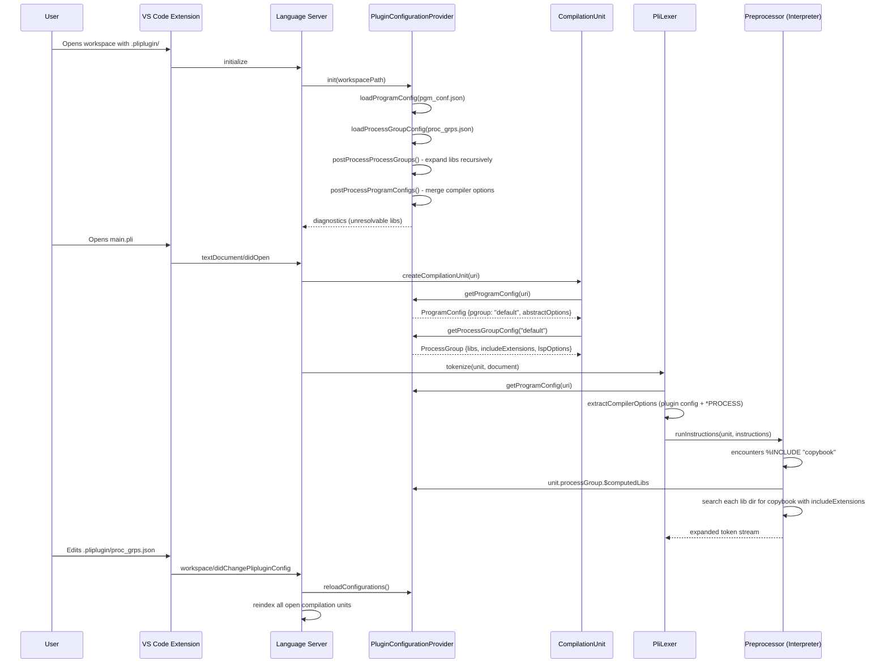

# Configuration System (.pliplugin)

This document describes the workspace configuration system used by the PL/I language server: the `.pliplugin` folder, how configuration files are loaded and applied, and how compiler options and include paths are resolved.

See [Architecture Overview](architecture-overview.md) for how the configuration fits into the overall system. For PL/I-specific terminology, see the [Glossary](glossary.md).

---

## 1. What the `.pliplugin` Folder Represents

The `.pliplugin/` folder is a **workspace-level configuration directory** that tells the language server how to analyze your code. It answers:

- **Which PL/I files are entry points** (i.e. which files start a compilation unit).
- **How each entry point should be compiled** (which libraries to search for `%INCLUDE`, which compiler options to apply, which file extensions to recognize).

Without `.pliplugin/`, the language server cannot resolve `%INCLUDE` directives (it does not know where to look for copybooks) and cannot apply project-specific compiler options. When the folder is missing, the extension can prompt the user to create one.

---

## 2. The Two Configuration Files

### pgm_conf.json — Program Configuration

Maps source files (entry points) to process groups. Schema: `packages/vscode-extension/schemas/pgm_conf.schema.json`.

**Structure:**

```json
{
  "pgms": [
    {
      "program": "src/main.pli",
      "pgroup": "default",
      "compiler-options": ["MARGINS(2,72)"]
    }
  ]
}
```

| Field | Description |
|-------|-------------|
| `program` | Path to the PL/I source file (relative to workspace, or absolute). Supports **glob patterns** via minimatch (e.g. `**/*.pli`). |
| `pgroup` | Name of the process group this program belongs to. Must match a `name` in `proc_grps.json`. |
| `compiler-options` | Optional per-program compiler options; merged with the process group’s options. |

### proc_grps.json — Process Groups Configuration

Defines named groups of settings. Schema: `packages/vscode-extension/schemas/proc_grps.schema.json`.

**Structure:**

```json
{
  "pgroups": [
    {
      "name": "default",
      "compiler-options": ["MARGINS(2,72)", "PP(MACRO)"],
      "libs": ["cpy", "inc"],
      "include-extensions": [".pli", ".pl1", ".inc"],
      "member-name-validation": false,
      "lsp-options": {
        "check-margins": true,
        "instruction-counter-limit": 5000,
        "case-upper-validation": true
      }
    }
  ]
}
```

| Field | Description | Default |
|-------|-------------|---------|
| `name` | **Required.** Unique name for this process group. Referenced by `pgroup` in `pgm_conf.json`. | — |
| `libs` | Directories (relative to workspace, or absolute) where `%INCLUDE` files are searched. Subdirectories are **recursively expanded** at load time into a computed list (`$computedLibs`). | `[]` |
| `compiler-options` | PL/I `*PROCESS`-style options applied to all programs in this group (e.g. `MARGINS(2,72)`, `PP(MACRO)`). | `[]` |
| `include-extensions` | File extensions to try when resolving `%INCLUDE` (e.g. `.pli`, `.pl1`, `.inc`, `.cpy`). The name in the `%INCLUDE` directive is searched with each extension appended. | `[]` |
| `member-name-validation` | If `true`, validates that include member names follow mainframe rules (max 8 characters, starts with a letter, alphanumeric + `@`, `#`, `_`, `$`). | `undefined` (disabled) |
| `lsp-options.check-margins` | If `true`, reports diagnostics when code falls outside the configured margins. | `false` |
| `lsp-options.instruction-counter-limit` | Maximum number of preprocessor VM instructions before the server halts expansion (prevents infinite loops in macro expansion). | `100000` |
| `lsp-options.case-upper-validation` | If `true`, validates that PL/I keywords are uppercase (common convention on mainframes). | `true` |

---

## 3. How Process Groups Work

A process group is a **named set of build settings** (like a build configuration). The relationship is:

```
pgm_conf.json              proc_grps.json
┌─────────────────┐        ┌────────────────────┐
│ program: A      │───────>│ name: "default"    │
│ pgroup: default │        │ libs: [cpy, inc]   │
├─────────────────┤        │ compiler-options   │
│ program: B      │───────>│ include-extensions │
│ pgroup: default │        │ lsp-options        │
├─────────────────┤        └────────────────────┘
│ program: C      │        ┌────────────────────┐
│ pgroup: prod    │───────>│ name: "prod"      │
└─────────────────┘        │ libs: [/usr/lib]  │
                           └────────────────────┘
```

Multiple programs can share one process group, similar to mainframe setups where several programs share the same SYSLIB concatenation.

---

## 4. How Programs Are Mapped to Process Groups

Lookup is implemented in `getProgramConfig()` in `packages/language/src/workspace/plugin-configuration-provider.ts`:

1. **Exact URI match** — The file’s URI is compared to registered program keys.
2. **Glob pattern match** — If there is no exact match, each registered program pattern is tested with `minimatch` (e.g. `**/*.pli`).
3. **Library file detection** — If the file is under a known library path (`isLibFileCandidate()`), it is treated as a copybook and does **not** get its own compilation unit.

Once a `ProgramConfig` is found, its `pgroup` is used to look up the `ProcessGroup` in the process group map.

---

## 5. How Compiler Options and Include Paths Are Resolved

### Compiler options

Compiler options come from three sources and are merged in two phases:

**Phase A — At config load time** (`postProcessProgramConfigs()` in `plugin-configuration-provider.ts`):

The per-program options (from `pgm_conf.json`) and per-group options (from `proc_grps.json`) are **concatenated** (program options first, then group options) and parsed into `AbstractCompilerOptions`. The parsed result is cached on `ProgramConfig.abstractOptions` so it does not need to be re-parsed for every file open.

**Phase B — At tokenization time** (`CompilerOptionsProcessor.extractCompilerOptions()` in `packages/language/src/preprocessor/compiler-options-processor.ts`):

1. Plugin config options (the cached `abstractOptions` from Phase A) are translated first.
2. Source `*PROCESS` directives found in the `.pli` file are translated second.
3. **Later options override earlier ones** for conflicting settings (e.g. if both the plugin config and the `*PROCESS` directive set `MARGINS`, the `*PROCESS` value wins).
4. The combined result becomes the `CompilerOptions` on the `CompilationUnit`, controlling margins, macro behavior, and other settings used throughout the pipeline.

### Include path resolution

When the preprocessor sees `%INCLUDE`, resolution is done in `resolveIncludeFileUri()` in `packages/language/src/preprocessor/instruction-interpreter.ts`:

1. **Process group** — From `unit.processGroup`, or by matching the current file’s URI to known lib paths.
2. **Library list** — Iterate over `pgroup.$computedLibs` (recursively expanded library directories).
3. For each lib entry:
   - **Directory entries:** Search for the file by name using each `includeExtensions`.
   - **DD-name entries:** Search for `ddname(member)`-style references (mainframe partitioned datasets).
4. If `memberNameValidation` is enabled, member names are validated.

---

## 6. Where Configuration Is Discovered, Validated, and Applied

### Discovery

| Location | What happens |
|----------|------------------|
| `packages/vscode-extension/src/extension/main.ts` (lines 44–47) | Extension sets up a file watcher on `.pliplugin/` and `.pliplugin/*.json`. |
| `packages/vscode-extension/src/extension/main.ts` (lines 173–234) | `watchPlipluginFolder()` sends `WorkspaceDidChangePlipluginConfigNotification` to the language server on any change. |
| `packages/vscode-extension/src/common/missing-config-handler.ts` (lines 19–99) | When a PL/I file is opened and `.pliplugin/` does not exist, the user is prompted to create it. |
| `packages/language/src/language-server/connection-handler.ts` (lines 127–145) | `onInitialized` calls `PluginConfigurationProviderInstance.init(folder.uri)` for each workspace folder. |
| `packages/language/src/language-server/connection-handler.ts` (lines 328–344) | `onNotification(WorkspaceDidChangePlipluginConfigNotification)` calls `reloadConfigurations()` and reindexes open compilation units. |

### Loading and parsing

| Location | What happens |
|----------|------------------|
| `plugin-configuration-provider.ts` (lines 328–340) | `loadConfigurations()` reads both JSON files from `.pliplugin/` via the `FileSystemProvider`. |
| `plugin-configuration-provider.ts` (lines 346–369) | `loadProgramConfig()` parses `pgm_conf.json` and resolves relative paths against the workspace. |
| `plugin-configuration-provider.ts` (lines 445–474) | `loadProcessGroupConfig()` parses `proc_grps.json` and triggers post-processing. |
| `plugin-configuration-provider.ts` (lines 481–590) | `postProcessProcessGroups()` recursively expands lib directories, resolves DD-name entries, and reports diagnostics for unresolvable libs. |
| `plugin-configuration-provider.ts` (lines 596–625) | `postProcessProgramConfigs()` merges compiler options from program and group and pre-parses them. |

### Validation

- **JSON schema:** VS Code’s JSON language service validates against the schemas registered in the extension’s `package.json` for `.pliplugin/pgm_conf.json` and `.pliplugin/proc_grps.json`.
- **Library resolution:** `postProcessProcessGroups()` emits diagnostics when a lib path cannot be read (e.g. code `COPC01`).
- **Compiler option parsing:** Errors are reported as diagnostics tied to the `*PROCESS` directive or the config file.

### Application to analysis

| Location | What happens |
|----------|------------------|
| `packages/language/src/workspace/compilation-unit.ts` (lines 182–203) | `CompilationUnit.programConfig` and `.processGroup` are lazy getters that call `PluginConfigurationProviderInstance`. |
| `packages/language/src/workspace/compilation-unit.ts` (line 249) | `getOrCreateCompilationUnit()` uses `isLibFileCandidate()` to avoid creating compilation units for standalone library files. |
| `packages/language/src/preprocessor/pli-lexer.ts` (lines 61–66) | `PliLexer.tokenize()` calls `extractCompilerOptions()`, which uses `getProgramConfig(uri)` and merges plugin and source options. |
| `packages/language/src/preprocessor/pli-lexer.ts` (line 65) | Merged options are assigned to `unit.compilerOptions` (margins, macro behavior, etc.). |
| `packages/language/src/preprocessor/instruction-interpreter.ts` (lines 2362–2375) | `resolveIncludeFileUri()` uses `unit.processGroup` (or `getProcessGroupConfigFromLib()`) to get library paths. |
| `packages/language/src/preprocessor/instruction-interpreter.ts` (lines 2392–2513) | Computed libs are iterated to search for include files using `pgroup.includeExtensions`. |
| `packages/language/src/preprocessor/instruction-interpreter.ts` (lines 2228–2256) | On include resolution failure, the diagnostic depends on config: `MissingConfiguration` when there is no config, `IBM1848I` when config exists but the file is not found. |

---

## 7. Configuration Flow (Sequence)



---

## 8. Design Notes

1. **Singleton:** `PluginConfigurationProviderInstance` is a module-level singleton shared by the language server process.
2. **Lazy resolution:** `CompilationUnit.programConfig` and `.processGroup` are getters with a null-cache: resolved once per unit and cleared on `reset()`.
3. **Library files:** Files under library paths (`isLibFileCandidate()`) do not get their own compilation unit; they are only analyzed when included from an entry-point file.
4. **Glob program paths:** `pgm_conf.json` program entries can use globs (e.g. `**/*.pli`) to configure many files at once.
5. **Config creation:** The `commandCreateConfig` command and related quick fix can create `.pliplugin/` config when include resolution fails.
