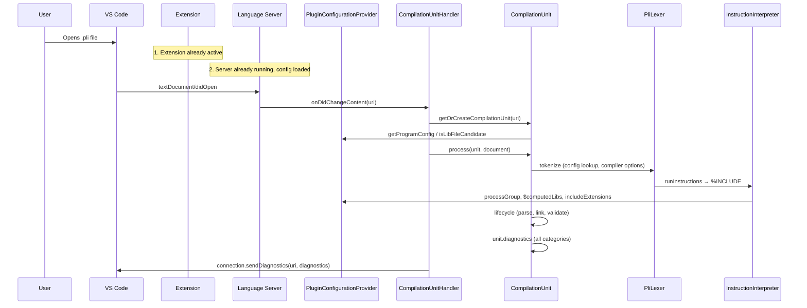

# Execution Flow: Opening a PL/I File

This document traces the runtime flow when a user opens a PL/I file in VS Code, from extension activation through diagnostics. Each step lists the files that implement it, with line references so you can follow along in the source.

**Prerequisites:** Read the [Architecture Overview](architecture-overview.md) and [Configuration System](configuration-system.md) first. For PL/I-specific terminology, see the [Glossary](glossary.md).

---

## Overview

---

## 1. VS Code Extension Activation

**When:** VS Code loads the extension (e.g. when a workspace is opened or the extension is first needed).

**Files:**

| File | Role |
|------|------|
| `packages/vscode-extension/src/extension/main.ts` | Entry point. `activate(context)` runs once. |

**What happens:**

1. **`activate()`** (line 31):
   - **`BuiltinFileSystemProvider.register(context)`** — Registers the `pli-builtin://` URI scheme so the language server can read built-in PL/I declarations.
   - **`Settings.getInstance()`** — Initializes settings (skipped code, margin indicators).
   - **`startLanguageClient(context)`** — Creates the `LanguageClient` and starts it (which spawns the language server process).
   - **`registerCustomDecorators(client, settings)`** — Registers decorators for skipped code and margin rulers.
2. **`registerOnDidChangeActiveTextEditor()`** (lines 56–61) — Listens for editor changes to optionally prompt for creating `.pliplugin` when missing.
3. **`registerOnDidOpenTextDocListener()`** (lines 63–88) — Listens for document open (e.g. for telemetry when `.pliplugin` is missing).
4. **`watchPlipluginFolder()`** (lines 173–234) — Creates file watchers on `.pliplugin` and `.pliplugin/*.json`; on any change sends `WorkspaceDidChangePlipluginConfigNotification` to the language server.
5. **`handleMissingConfig(activeTextEditor)`** (line 49) — If the active document is PL/I and `.pliplugin` does not exist, may prompt to create config.

**Relevant code:** `packages/vscode-extension/src/extension/main.ts` lines 31–50, 123–167, 173–234.

---

## 2. Language Server Startup

**When:** The extension starts the language client, which spawns the server process and establishes the LSP connection.

**Files:**

| File | Role |
|------|------|
| `packages/vscode-extension/src/language/main.ts` | Server process entry. Sets up the file system provider and calls `startLanguageServer`. |
| `packages/language/src/language-server/connection-handler.ts` | Registers LSP handlers and initializes the compilation unit handler and configuration. |

**What happens:**

1. **Server process starts** (`packages/vscode-extension/src/language/main.ts`):
   - **`setFileSystemProvider(new NodeFileSystemProvider())`** — Injects the Node.js file system (readFile, readDir, search, etc.) for the language server.
   - **`createConnection(ProposedFeatures.all)`** — Creates the LSP connection (stdio or IPC from the client).
   - **`startLanguageServer(connection)`** — Enters the core server logic.

2. **`startLanguageServer(connection)`** (`packages/language/src/language-server/connection-handler.ts`):
   - **Line 60:** Creates **`CompilationUnitHandler`**.
   - **Line 61:** **`compilationUnitHandler.listen(connection)`** — Subscribes to document open/change/close (see step 3).
   - **Lines 82–126:** **`connection.onInitialize`** — Returns server capabilities (completion, hover, definition, references, etc.). Stores workspace folders (reversed) for later config init.
   - **Lines 127–145:** **`connection.onInitialized`** — For each workspace folder calls **`PluginConfigurationProviderInstance.init(folder.uri)`**, which loads `pgm_conf.json` and `proc_grps.json`, expands libs, and merges compiler options. Sends any config-load diagnostics to the client for `proc_grps.json`. Then **`compilationUnitHandler.markReady()`** so LSP requests can run.
   - **Line 378:** **`connection.listen()`** — Starts handling LSP messages.

**Relevant code:**  
- `packages/vscode-extension/src/language/main.ts` (full file).  
- `packages/language/src/language-server/connection-handler.ts` lines 59–61, 82–145, 378.

---

## 3. File Analysis (Document Open → Lifecycle)

**When:** The user opens a PL/I file (or changes it). The client sends `textDocument/didOpen` (or `didChange`); the server runs the analysis pipeline for that document’s compilation unit.

**Files:**

| File | Role |
|------|------|
| `packages/language/src/language-server/text-documents.ts` | Listens to LSP document events and exposes `onDidOpen` / `onDidChangeContent`. |
| `packages/language/src/workspace/compilation-unit.ts` | Subscribes to document events, creates/gets compilation unit, runs `process()` (lifecycle + diagnostics send). |
| `packages/language/src/workspace/lifecycle.ts` | Defines and runs the pipeline: tokenize → parse → generateSymbolTable → link → preprocessorValidate → validate. |
| `packages/language/src/preprocessor/pli-lexer.ts` | Implements tokenization (margins, compiler options, preprocessor parse, instruction generation, instruction execution). |
| `packages/language/src/parser/parser.ts` | Parses the token stream into the PL/I AST. |
| `packages/language/src/linking/symbol-table.ts` | Builds symbol table and scope caches. |
| `packages/language/src/linking/resolver.ts` | Resolves references and reports linking errors. |
| `packages/language/src/validation/validator.ts` | Runs preprocessor and PL/I validation checks. |

**What happens:**

1. **Client sends `textDocument/didOpen`** with the document’s URI, languageId, version, and text.

2. **`EditorDocuments.listen(connection)`** (`packages/language/src/language-server/text-documents.ts` lines 279–298):
   - **`connection.onDidOpenTextDocument`** (line 284) creates a `TextDocument`, stores it in `_syncedDocuments`, then fires **`_onDidOpen`** and **`_onDidChangeContent`** (with empty `changes`).

3. **`CompilationUnitHandler.listen(connection)`** (`packages/language/src/workspace/compilation-unit.ts` lines 291–298):
   - Subscribes **`textDocuments.onDidChangeContent`** → **`this.updateUri(uri)`** for the opened/changed document.

4. **`updateUri(uri)`** (`packages/language/src/workspace/compilation-unit.ts` lines 332–356):
   - Acquires **`globalMutex`**, waits for **`ready`**.
   - **`getOrCreateCompilationUnit(uri)`** — Creates or reuses the compilation unit (and may skip creation for library-only files; see step 4).
   - Runs **`unit.mutex.run(...)`** which:
     - Gets the document from **`EditorDocuments.get(unit.uri)`**.
     - Calls **`this.process(unit, document, connection, cancellationToken)`**.
     - Clears include cache and revalidates request caches (e.g. margin indicator, skipped code).

5. **`process(unit, document, connection, cancellationToken)`** (`packages/language/src/workspace/compilation-unit.ts` lines 364–393):
   - **`lifecycle(unit, document, cancellationToken)`** — Runs the full analysis pipeline.
   - Maps all URIs in `unit.services.files` to this `unit` in `compilationUnits`.
   - **`diagnosticsToLSP(unit, unit.diagnostics.getAll())`** — Converts in-memory diagnostics to LSP form per file.
   - For each file in the unit that is open and not built-in, **`connection.sendDiagnostics({ uri: file, diagnostics })`** (see step 6).

6. **`lifecycle(compilationUnit, document, cancellationToken)`** (`packages/language/src/workspace/lifecycle.ts` lines 30–49) runs **six steps** in fixed order. Between each step, `interruptAndCheck(cancellation)` allows the server to cancel outdated work:
   1. **`compilationUnit.reset()`** — Clears all caches, diagnostics, and scope data from any previous run.
   2. **`tokenize(compilationUnit, document)`** — Runs the lexer + preprocessor pipeline. This is where compiler options are extracted, margins are processed, preprocessor macros are expanded, and `%INCLUDE` files are resolved and spliced in. (See steps 4 and 5 below for details.)
   3. **`parse(compilationUnit)`** — The handwritten recursive-descent parser builds the AST from the token stream. Parser diagnostics are added under the `Parser` category.
   4. **`generateSymbolTable(compilationUnit)`** — Walks the AST to index all declarations (variables, labels, procedures, types) into a `SymbolTable`, sets `container` pointers on every AST node, and collects references into the `ReferencesCache`.
   5. **`link(compilationUnit)`** — Resolves all references against the symbol table via `resolveReferences(unit)`, then converts unresolved references, redeclarations, and unreferenced labels into diagnostics under the `Linking` category.
   6. **`preprocessorValidate(compilationUnit)`** + **`validate(compilationUnit)`** — Runs two sets of modular validation rules: preprocessor checks on the preprocessor AST, then PL/I checks (IBM compiler codes, type checking, deprecation warnings) on the main AST. All results go under the `Validation` category.

**Relevant code:**  
- `packages/language/src/language-server/text-documents.ts` lines 279–298.  
- `packages/language/src/workspace/compilation-unit.ts` lines 291–298, 332–356, 364–393.  
- `packages/language/src/workspace/lifecycle.ts` lines 30–49, 53–106.

---

## 4. Configuration Lookup

**When:** During file analysis: when deciding whether to create a compilation unit, when building compiler options, and when resolving includes.

**Files:**

| File | Role |
|------|------|
| `packages/language/src/workspace/plugin-configuration-provider.ts` | Loads and caches `pgm_conf.json` and `proc_grps.json`; exposes `getProgramConfig`, `getProcessGroupConfig`, `getProcessGroupConfigFromLib`, `isLibFileCandidate`. |
| `packages/language/src/workspace/compilation-unit.ts` | Uses config for `programConfig` and `processGroup` getters and in `getOrCreateCompilationUnit`. |
| `packages/language/src/preprocessor/compiler-options-processor.ts` | Uses `getProgramConfig(uri)` to merge plugin compiler options with source `*PROCESS` directives. |

**What happens:**

1. **At server init** (`connection-handler.ts` lines 127–145):  
   **`PluginConfigurationProviderInstance.init(folder.uri)`** loads and parses `.pliplugin/pgm_conf.json` and `.pliplugin/proc_grps.json`, expands libs in **`postProcessProcessGroups()`**, and merges compiler options in **`postProcessProgramConfigs()`**. So configuration is ready before any document is analyzed.

2. **When creating or reusing a compilation unit** (`packages/language/src/workspace/compilation-unit.ts`):
   - **`getOrCreateCompilationUnit(uri)`** (lines 243–257): Calls **`PluginConfigurationProviderInstance.isLibFileCandidate(uri)`**. If the URI is under a configured library path, returns `undefined` (no compilation unit for standalone library files). Otherwise **`createAndStoreCompilationUnit(uri)`**.
   - **`createCompilationUnit(uri)`** (lines 133–218): The unit’s **`programConfig`** getter (lines 182–189) calls **`PluginConfigurationProviderInstance.getProgramConfig(uri)`** (exact URI then glob match). The **`processGroup`** getter (lines 190–203) uses **`programConfig.pgroup`** and **`PluginConfigurationProviderInstance.getProcessGroupConfig(pgroup)`**. Both are cached on the unit until **`reset()`**.

3. **When tokenizing** (`packages/language/src/preprocessor/compiler-options-processor.ts` lines 38–127):
   - **`extractCompilerOptions(text, uri)`** calls **`PluginConfigurationProviderInstance.getProgramConfig(uri)`** (line 74). If present, it uses **`programConfig.abstractOptions`** and **`programConfig.issues`** and translates plugin compiler options first, then source `*PROCESS` directives. So configuration lookup for compiler options happens during the first tokenize of the entry-point document.

4. **When resolving includes** (step 5): The interpreter uses **`unit.processGroup`** (and optionally **`getProcessGroupConfigFromLib(currentUri)`** for library files), which ultimately came from the same **`getProgramConfig`** / **`getProcessGroupConfig`** lookups.

**Relevant code:**  
- `packages/language/src/workspace/plugin-configuration-provider.ts` (e.g. `getProgramConfig` 762–787, `getProcessGroupConfig` 809–811, `isLibFileCandidate` 298–311, `getProcessGroupConfigFromLib` 819–833).  
- `packages/language/src/workspace/compilation-unit.ts` lines 182–203, 243–257.  
- `packages/language/src/preprocessor/compiler-options-processor.ts` lines 73–105.

---

## 5. Include Resolution

**When:** During tokenization, when the preprocessor VM runs an `Include` instruction (e.g. from `%INCLUDE "file"` or `%INSCAN`). Part of **`runInstructions`** invoked from **`PliLexer.tokenize`**.

**Files:**

| File | Role |
|------|------|
| `packages/language/src/preprocessor/instruction-interpreter.ts` | Runs the preprocessor VM; implements **`runIncludeInstruction`** and **`resolveIncludeFileUri`** using process group libs and include extensions. |
| `packages/language/src/workspace/plugin-configuration-provider.ts` | Provides **`getProcessGroupConfigFromLib`** and the process group’s **`$computedLibs`** and **`includeExtensions`**. |
| `packages/language/src/workspace/file-system-provider.ts` | **`FileSystemProviderInstance.search(options)`** used to find a file under a lib path or a member in a DD-style path. |

**What happens:**

1. **`PliLexer.tokenize()`** (`packages/language/src/preprocessor/pli-lexer.ts` lines 68–109) builds instructions for the entry-point file (and any `incAfter`), then calls **`runInstructions(unit, uri, instruction.result, options)`** (line 106). That runs the VM; when it hits an **Include** instruction it calls **`runIncludeInstruction`**.

2. **`runIncludeInstruction`** (`packages/language/src/preprocessor/instruction-interpreter.ts` line 2123) receives the include item (file or member). It calls **`resolveIncludeFileUri(item, context)`** (line 2221) to get the resolved URI. If resolution fails, it pushes a diagnostic (e.g. **MissingConfiguration** or **IBM1848I**) and returns null (lines 2223–2256).

3. **`resolveIncludeFileUri(item, context)`** (`packages/language/src/preprocessor/instruction-interpreter.ts` lines 2359–2540):
   - Gets **`pgroup`** from **`context.unit.processGroup`** or **`PluginConfigurationProviderInstance.getProcessGroupConfigFromLib(context.currentUri)`** (lines 2366–2375). If no process group, returns `undefined`.
   - Gets **`pgroup.$computedLibs`** and **`fileNameOrPartial`** from the include item (lines 2392–2399).
   - For each lib in **`$computedLibs`**:
     - **Directory entries:** Builds a candidate URI with **`resolveLibFileUri(lib.dir, fileNameOrPartial)`**, then calls **`FileSystemProviderInstance.search({ path: libFileUri, extensions: pgroup.includeExtensions })`** or member search (lines 2491–2519).
     - **DD-name entries:** Uses **`search`** for member-style paths (lines 2520–2538).
   - Optionally runs **`checkToValidateMember`** when **`pgroup.memberNameValidation`** is enabled (lines 2435–2456).
   - Returns the first matching URI or `undefined`.

4. Back in **`runIncludeInstruction`**, if a URI was returned, the included file is read, margin-processed, tokenized, preprocessor-parsed, and instructions generated (cached in **`instructionCache`**). Then **`doRunInstructions`** is run for the included content. Included file and tokens are added to **`context.unit.services.files`** and **`context.diagnostics`** (lines 2277–2326). So include resolution is what pulls in copybooks and adds them to the same compilation unit.

**Relevant code:**  
- `packages/language/src/preprocessor/instruction-interpreter.ts` lines 324–396 (runInstructions / runInstructionNode), 457–470 (runInstruction → runIncludeInstruction), 2123–2327 (runIncludeInstruction), 2359–2540 (resolveIncludeFileUri).

---

## 6. Diagnostics Generation

**When:** Throughout the lifecycle. Each phase adds to **`unit.diagnostics`** (a **`DiagnosticsStore`**). After **`process()`** finishes the lifecycle, it converts stored diagnostics to LSP and sends them per file.

**Files:**

| File | Role |
|------|------|
| `packages/language/src/validation/diagnostics-store.ts` | **`DiagnosticsStore`**: categories (CompilerOptions, Lexer, Parser, SymbolTable, Linking, TypeSystem, Validation), **`add`** / **`addAll`**, **`getAll()`**. Uses a key-based deduplication so the same diagnostic is never reported twice. |
| `packages/language/src/language-server/types.ts` | **`diagnosticsToLSP(unit, diagnostics)`** — Maps diagnostics to LSP format and groups by URI. |
| `packages/language/src/workspace/compilation-unit.ts` | **`process()`** calls **`unit.diagnostics.getAll()`**, then **`diagnosticsToLSP`**, then **`connection.sendDiagnostics`** per file. |
| Various | Lexer, parser, resolver, validators, type system, and instruction interpreter push or add diagnostics into **`unit.diagnostics`** or into arrays that are later **`addAll`’d**. |

**What happens:**

1. **Accumulation during lifecycle:**
   - **Lexer** (`pli-lexer.ts`): **`unit.diagnostics.addAll(DiagnosticCategory.Lexer, instruction.diagnostics)`**, margins issues, **`output.errors`** from **`runInstructions`**, and compiler-option issues (lines 90–124). Include-resolution failures are pushed inside **`runIncludeInstruction`** in **instruction-interpreter.ts** and end up in **`output.errors`**.
   - **Parser** (`lifecycle.ts` line 75): **`compilationUnit.diagnostics.addAll(DiagnosticCategory.Parser, diagnostics)`** from **`parsePli(compilationUnit.tokens)`**.
   - **Linking** (`validator.ts` line 122): **`linkingErrorsToDiagnostics(..., unit.diagnostics.getAcceptor(DiagnosticCategory.Linking), ...)`**.
   - **Preprocessor validation** (`validator.ts` line 49): **`unit.diagnostics.getAcceptor(DiagnosticCategory.Validation)`** used by **`validateSyntaxNode(unit.preprocessorAst, ppValidations)`**.
   - **PL/I validation** (`validator.ts` line 59): Same acceptor for **`validateSyntaxNode(unit.ast, pliValidations)`** (e.g. IBM compiler-style checks).
   - **Type system** (e.g. **infer.ts**, **composite-type-builder.ts**): **`compilationUnit.diagnostics.addAll(DiagnosticCategory.TypeSystem, ...)`** during type checking.

2. **Sending to the client** (`packages/language/src/workspace/compilation-unit.ts` lines 364–386):
   - After **`lifecycle(unit, document, cancellationToken)`**, **`allDiagnostics = diagnosticsToLSP(unit, unit.diagnostics.getAll())`** (line 375).
   - For each URI in **`unit.services.files.keys()`**, if the file is not built-in and is open in the editor, **`connection.sendDiagnostics({ uri: file, diagnostics: fileDiagnostics ?? [] })`** (lines 376–385).

3. **Config-load diagnostics** are sent separately in **`connection-handler.ts`** (lines 131–138) for **`PluginConfiguration.PROCESS_GROUP_FILE_PATH`** after **`PluginConfigurationProviderInstance.init(folder.uri)`**.

**Relevant code:**  
- `packages/language/src/validation/diagnostics-store.ts` (class **DiagnosticsStore**, **getAll** line 70).  
- `packages/language/src/language-server/types.ts` (**diagnosticsToLSP**).  
- `packages/language/src/workspace/compilation-unit.ts` lines 375–385.  
- `packages/language/src/workspace/lifecycle.ts` line 75; `packages/language/src/validation/validator.ts` lines 49, 59, 122; `packages/language/src/preprocessor/pli-lexer.ts` lines 90–124.

---

## Summary Table

| Step | Main files |
|------|------------|
| 1. Extension activation | `packages/vscode-extension/src/extension/main.ts` |
| 2. Language server startup | `packages/vscode-extension/src/language/main.ts`, `packages/language/src/language-server/connection-handler.ts` |
| 3. File analysis | `packages/language/src/language-server/text-documents.ts`, `packages/language/src/workspace/compilation-unit.ts`, `packages/language/src/workspace/lifecycle.ts`, `packages/language/src/preprocessor/pli-lexer.ts`, parser, linking, validation |
| 4. Configuration lookup | `packages/language/src/workspace/plugin-configuration-provider.ts`, `packages/language/src/workspace/compilation-unit.ts`, `packages/language/src/preprocessor/compiler-options-processor.ts` |
| 5. Include resolution | `packages/language/src/preprocessor/instruction-interpreter.ts`, `packages/language/src/workspace/plugin-configuration-provider.ts`, `packages/language/src/workspace/file-system-provider.ts` |
| 6. Diagnostics generation | `packages/language/src/validation/diagnostics-store.ts`, `packages/language/src/language-server/types.ts`, `packages/language/src/workspace/compilation-unit.ts`, plus all phases that call **`diagnostics.addAll`** or **`getAcceptor`** |
