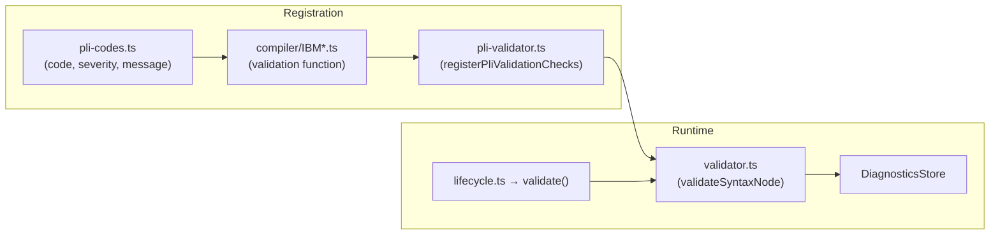

# How to Add a Validation Rule

This guide walks through adding a new diagnostic rule to the PL/I language server. Validation rules are modular: each rule is a self-contained function that checks one AST node type and reports diagnostics. No changes to the pipeline are needed.

---

## Overview

The validation system works in three layers:

1. **PL/I codes** (`validation/pli-codes.ts`) — defines diagnostic codes, severity, and message templates.
2. **Validation functions** (`validation/compiler/IBM*.ts`) — each file implements one or more checks for a specific AST node type.
3. **Registry** (`validation/pli-validator.ts`) — maps AST node types (`SyntaxKind`) to arrays of validation functions.

When the lifecycle reaches the `validate()` step, the validator walks the AST and for each node, calls all registered functions for that node's `SyntaxKind`.

---

## Step-by-Step

### 1. Define the Diagnostic Code

Open `packages/language/src/validation/pli-codes.ts` and add your code to the appropriate severity group (`Info`, `Warning`, `Error`, `Severe`):

```typescript
IBM9999I: {
  code: "IBM9999I",
  severity: Severity.I,
  message: "Example: this statement does something noteworthy.",
},
```

The naming convention follows IBM PL/I compiler codes: `IBM` + number + severity letter (`I`=Info, `W`=Warning, `E`=Error, `S`=Severe).

If your diagnostic message needs parameters, use a function instead of a string:

```typescript
IBM9999I: {
  code: "IBM9999I",
  severity: Severity.I,
  message: (name: string) => `Variable '${name}' is used before declaration.`,
},
```

### 2. Write the Validation Function

Create a new file under `packages/language/src/validation/compiler/`:

```
packages/language/src/validation/compiler/IBM9999I-description-of-check.ts
```

The naming convention is `IBM<code>-short-description.ts`.

**Example — a simple check:**

```typescript
import { PLICodes } from "../pli-codes";
import { diagnosticFromCode } from "../../language-server/types";
import * as AST from "../../syntax-tree/ast";
import { ValidationAcceptor } from "../validator";

/**
 * IBM9999I: The ERROR condition will be raised if ...
 */
export function IBM9999I_description_of_check(
  node: AST.SelectStatement,  // The AST node type this check operates on
  acceptor: ValidationAcceptor,
) {
  // 1. Get the token to anchor the diagnostic on
  const token = node.selectToken;
  if (!token) return;

  // 2. Check the condition
  const hasProblem = /* your check logic */;
  if (!hasProblem) return;

  // 3. Report the diagnostic
  acceptor(diagnosticFromCode(PLICodes.Info.IBM9999I, token));
}
```

**Key points:**

- The first parameter is the AST node — its type must match the `SyntaxKind` you register against.
- The second parameter is the `ValidationAcceptor` — call it with a `Diagnostic` to report an issue.
- The third parameter (optional) is the `CompilationUnit`, available if you need broader context.
- Use `diagnosticFromCode(code, token)` to create a diagnostic anchored to a specific token's location.
- Return early (skip the check) when the token or condition is not applicable. Validation functions should be defensive.

**Signature:**

```typescript
type ValidationFunction<T extends SyntaxNode> = (
  node: T,
  acceptor: ValidationAcceptor,
  compilationUnit: CompilationUnit,
) => void;
```

### 3. Register the Function

Open `packages/language/src/validation/pli-validator.ts` and add your function to the `registerPliValidationChecks()` return object:

```typescript
import { IBM9999I_description_of_check } from "./compiler/IBM9999I-description-of-check";

export function registerPliValidationChecks(): ValidationChecks {
  return {
    // ... existing entries ...
    SelectStatement: [
      IBM1059I_select_without_otherwise,
      IBM9999I_description_of_check,   // <-- add here
    ],
  };
}
```

The key is the name of the `SyntaxKind` enum member (e.g. `SelectStatement`, `DeclaredVariable`, `ProcedureStatement`). The value is an array of validation functions. Multiple checks can run on the same node type.

### 4. Write Tests

**Option A: Fourslash test** (preferred for integration tests)

Create a file under `packages/language/test/fourslash/validate/IBM9999I/`:

```typescript
/// <reference path="../../../framework.ts" />

// @filename: main.pli
// @wrap: main
//// <|1>SELECT;
////   WHEN(1) PUT('one');
//// END;

verify.expectErrorCodesAt("1", code.Info.IBM9999I.fullCode);
```

**Option B: Unit test**

Create or extend a file under `packages/language/test/validation-messages/`:

```typescript
import { parseAndLink, assertDiagnostic } from "../utils";

test("IBM9999I: select without otherwise", () => {
  const { unit } = parseAndLink(`
    STARTPR: PROCEDURE OPTIONS (MAIN);
      SELECT;
        WHEN(1) PUT('one');
      END;
    END STARTPR;
  `);
  assertDiagnostic(unit.diagnostics.getAll(), "IBM9999I");
});
```

### 5. Run Tests

```bash
# Run all tests
pnpm test

# Run just your fourslash test
HARNESS_TEST_FILE=packages/language/test/fourslash/validate/IBM9999I/your-test.ts \
  pnpm vitest run packages/language/test/fourslash-harness/execute.test.ts
```

---

## Existing Examples to Study

| File | What it checks | Node type |
|------|---------------|-----------|
| `IBM1059I-select-without-otherwise.ts` | SELECT without OTHERWISE clause | `SelectStatement` |
| `IBM1219I-leave-exits-noniterative-do.ts` | LEAVE in non-iterative DO | `LeaveStatement` |
| `IBM2615I-do-loops-execute-once.ts` | DO loop that executes only once | `DoStatement` |
| `IBM1376IE-attributes-in-declaration-lists.ts` | Invalid attributes in declaration lists | `DeclareStatement` |
| `IBM3323I-IBM3324I-check-argument-count.ts` | Wrong number of arguments in a call | `CallStatement` |

These are all in `packages/language/src/validation/compiler/`. Read `IBM1059I` first — it is the simplest.

---

## Architecture Recap



The validator walks the AST. For each node, it looks up its `SyntaxKind` in the `ValidationChecks` registry and calls every matching function. Each function receives the node, an acceptor callback, and the compilation unit. Calling `acceptor(diagnostic)` adds the diagnostic to the `DiagnosticsStore`, which is later sent to VS Code.
