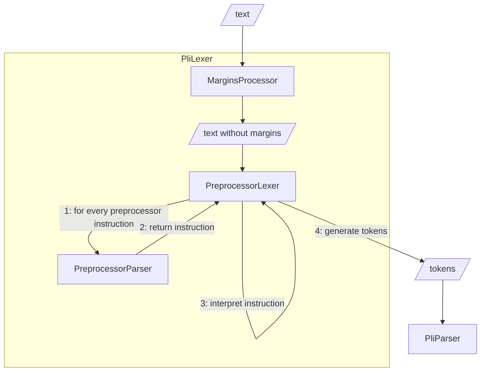

# Preprocessor implementation

The preprocessor is a tool that allows to modify the source code before it is parsed. So, the preprocessor returns a stream of tokens in the end, without reflecting the preprocessor instructions. The preprocessor instructions get expanded and produce more tokens.

## Terms and concepts

* `MarginsProcessor`: a processor that removes margins from the text. The text is replaced with spaces to have the same positions for the remaining text.
* `PreprocessorLexer`: a lexer that reads the source code and returns a stream of tokens. During the processing, it can interpret preprocessor instructions.
* `PreprocessorParser`: a parser that reads the stream of tokens and returns a preprocessor instruction AST (abstract syntax tree).
* `PliLexer`: a lexer that reads the source code and returns a stream of tokens. Here it forwards the tokens from the preprocessor. The actual interpreting of the preprocessor instructions is (currently!) done by the preprocessor lexer. This might change in the future.
* `PliParser`: a parser that reads the stream of tokens and returns a PL/I AST.

## The preprocessor algorithm

1. The `preprocessor lexer` reads the source code and for every preprocessor instruction (everything between `%` and `;`), it calls the preprocessor parser. Parts of the source code that are not preprocessor instructions are forwarded to the `PliLexer`.
2. This `preprocessor parser` returns exactly one `preprocessor instruction`.
3. The `preprocessor lexer` interprets the instruction and may adds new tokens to the output.
4. The preprocessor lexer emits tokens that are forwarded to the `PliLexer` and later used by the `PliParser`.
