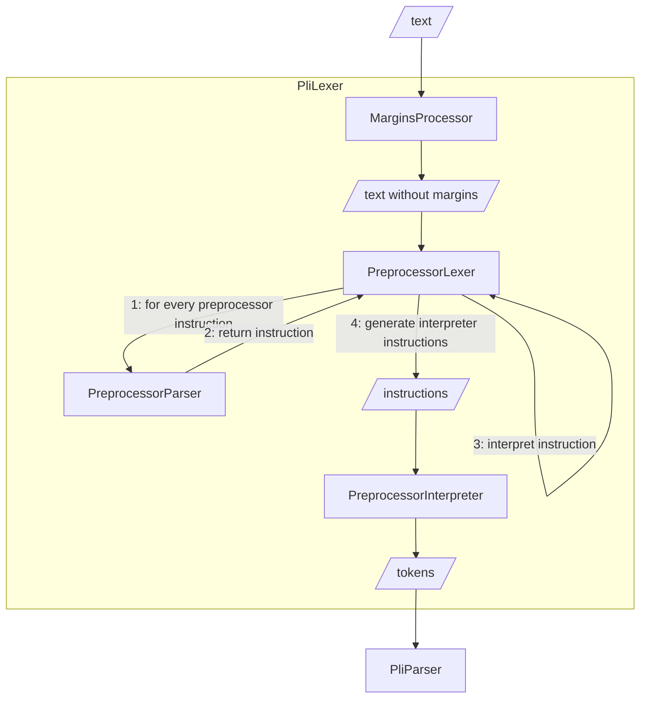

# Preprocessor implementation



The preprocessor is a tool that allows to modify the source code before it is parsed. So, the preprocessor returns a stream of tokens in the end, without reflecting the preprocessor instructions. The preprocessor instructions get expanded and produce more tokens.

## Terms and concepts

* `MarginsProcessor`: a processor that removes margins from the text. The text is replaced with spaces to have the same positions for the remaining text.
* `PreprocessorLexer`: this concept gets the source code from the margins processor and returns a program as a list of instructions. TODO should be called Generator?
* `PreprocessorParser`: this parser gets chunks of token sets and returns a single preprocessor statement.
* `PreprocessorInstruction`: a single preprocessor instruction that is returned by the preprocessor lexer, it instructs the `prepocessor interpreter`.
* `PreprocessorInterpreter`: a tool that interprets the preprocessor instructions and generates new tokens.
* `PliLexer`: from the ouside: gets text and returns tokens.
* `PliParser`: a parser that reads the stream of tokens and returns a PL/I AST.

## The preprocessor algorithm

### Process margins

The preprocessor gets the text from the `MarginsProcessor`. It cleans up the first character of the text and all characters from the 72th column.

### Lexing the margin-processed text

The margin-processed text is then lexed IN CHUNKS by the preprocessor lexer. 

That means, that we lex the text from % to the first semicolon. In that case, we handle this chunk of tokens as a preprocessor statement.

If the start was not a %, we lex the text until the next semicolon as well, but this chunk is handled as normal PL/1 tokens.

### Parsing the preprocessor statement

We get a chunk of preprocessor tokens and parse them. The parser returns a single preprocessor statement. The statement is then handled by the lexer again to produce interpreter instructions for the interpreter program.

#### Example

```plain
%dcl A fixed;

//will generate the following instructions

PUSH []
SET A
```

The entire set of instructions and the corresponding stack machine are described below.

### Handling normal PL/1 tokens

When the returned chunk does not begin with a percent sign, we handle it as normal PL/1 tokens. The chunk gets splitted by % sign occurences (concat semantic in PL/1). The splitted parts got pushed onto the stack, concatenated and finally printed to the output. After each push we check the TOP of stack for replacements through preprocessor variables.
In the end we just produce instructions for the interpreter machine which is described below.

### Executing the preprocessor program

The preprocessor interpreter gets those generated instructions called a program.

It is a simple loop of:

* read the current instruction under the program counter
* interpret the instruction
* move the program counter to the next instruction
* repeat until HALT was detected

## The preprocessor stack machine

The preprocessor stack machine is a simple stack machine that executes the preprocessor instructions. The instructions are generated by the preprocessor lexer and are interpreted by the preprocessor interpreter.

A program is just a readonly list of instructions.

The machine has four stateful components:

1. the token stack `S`: the stack is a list of a list of tokens. We will use `x:S` to denote that `x` is on the stack `S` (topmost element). Attention! `x` is again a list of tokens, like `[1,2,3]` or `[A,+,B]`.
2. the variable heap `V`: a map of variables and their values and properties; the values are token lists again; the properties are
   1. `type`: a string that indicates the type of the variable. It is either `fixed` or `character`.
   2. `active`: a boolean flag that indicates if the variable is active or not
   3. `scanmode`: a flag that indicates if the variable can be replaced only once (`SCAN`) or more often (`RESCAN`)
3. the program counter `PC`: a index pointing into the list of instruction (aka the program)
4. the output list `O`: a list of tokens that are PRINTed by the machine.

This state is managed in the preprocessor interpreter state class.

### Instructions

#### Instruction `ACTIVATE`

```plain
ACTIVATE <VARNAME> [<SCANMODE>];
```

Activates a variable in the variable heap. The optional `SCANMODE` parameter can be `SCAN` or `RESCAN`. If `SCAN` is set, the variable can be replaced only once. If `RESCAN` is set, the variable can be replaced multiple times.

##### Example Activate

Imagine you execute this instruction: `ACTIVATE A SCAN;`.
This is how the machine behave before and after the execution of `ACTIVATE`.

| Before | After |
|--------|-------|
| S and V={} | S and V={A:[]} and A is active, scan |
| S and V={A=[1,2,3]} and A active, rescan | S and V={A:[1,2,3]} and A is active, scan |
| S and V={A=[1,2,3]} and A inactive, scan | S and V={A:[1,2,3]} and A is active, scan |

#### Instruction `DEACTIVATE`

```plain
DEACTIVATE <VARNAME>;
```

Deactivates a variable in the variable heap.

##### Example Deactivate

Imagine you execute this instruction: `DEACTIVATE A;`.
This is how the machine behave before and after the execution of `DEACTIVATE`.

| Before | After |
|--------|-------|
| S and V={A:[1,2,3]} and A active, scan | S and V={A:[1,2,3]} and A inactive, scan |
| S and V={A:[1,2,3]} and A inactive, rescan | S and V={A:[1,2,3]} and A inactive, rescan |
| S and V={} | S and V={A:[]} and A is inactive, character, rescan |


#### Instruction `SCAN`

```plain
SCAN; //no parameters
```

Takes the topmost element from the stack and scans it for variables. If a variable is found, it gets replaced by the value from the variable heap.

##### Example Scan

Imagine you have a the tokens 1,2,3 assigned to a variable A: `V={A:[1,2,3]}`.

This is how the stack looks before and after the execution of `SCAN`.

| Before | After |
|--------|-------|
| [A]:S    | [1,2,3]:S |
| [B]:S | [B]:S |
| [A,B]:S | [1,2,3,B]:S |

#### Instruction `PRINT

```plain
PRINT; //no parameters
```

Takes the topmost element from the stack and outputs it to O.

##### Example Print

| Before | After |
|--------|-------|
| [A]:S and O=[] | S and O=[A] |
| []:S and O=[1,2,3] | S and O=[1,2,3] |
| [1,2,3]:S and O=[A,+,B] | S and O=[A,+,B,1,2,3] |

#### Instruction `SET`

```plain
SET <VARNAME>;
```

Takes the topmost element from the stack and assigns it to the variable `VARNAME`.

##### Example Set

Imagine you execute this instruction: `SET A;`.
This is how the machine behave before and after the execution of `SET`.

| Before | After |
|--------|-------|
| [1,2,3]:S and V={} | S and V={A:[1,2,3]} |
| [1,2,3]:S and V={A=[A,+,B]} | S and V={A:[1,2,3]} |
| []:S and V={} | S and V={A:[]} |

#### Instruction `PUSH`

```plain
PUSH <TOKENS>;
```

Pushes a list of tokens onto the stack.

##### Example Push

Imagine you execute this instruction: `PUSH [A,+,B];`.

| Before | After |
|--------|-------|
| S | [A,+,B]:S |
| [B]:S | [A,+,B]:[B]:S |
| []:S | [A,+,B]:[]:S |

#### Instruction `CONCAT`

```plain
CONCAT; //no parameters
```

Concatenates the topmost two elements of the stack.
If the last element of the left side and the first element of the right side are both identifiers, they get concatenated without a space (TODO what about concatenation with numbers?).

##### Example Concat

Imagine you execute this instruction: `CONCAT;`.

| Before | After |
|--------|-------|
| [B]:[A]:S | [AB]:S |
| [1,2,3]:[A,+,B]:S | [A,+,B,1,2,3]:S |

#### Instruction `HALT`

```plain
HALT; //no parameters
```

Halts the machine.
